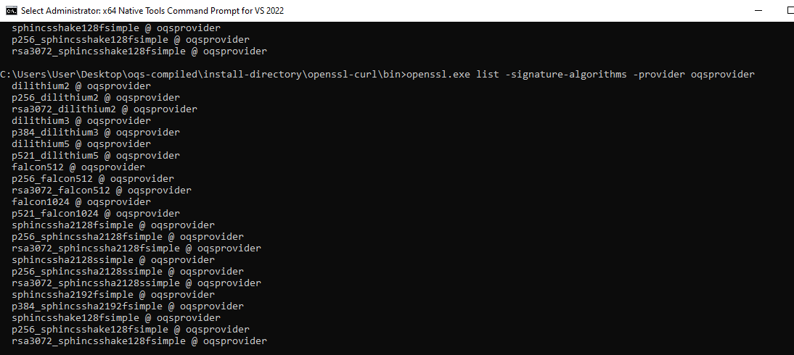

# 📚 Installation Instruction Manual 

Serving as a form of guidance, this manual follows through and details some of the major commands that I've utilized whilst attempting to install the Official Open Quantum Safe (OQS) curl binary with its additional dependencies for Windows. 


In most normal circumstances, usage of [oqs-provider's official Docker image of curl](https://hub.docker.com/r/openquantumsafe/curl) should suffice as its easy to setup with little hassle, is able to uninstall cleanly, and gets updates somewhat frequently. However, in the odd situation where you would need to have it installed onto a Windows environment, you're in luck!

If you do encounter any issues, do consult and sift through Open Quantum Safe's official documentations for similar issues and installation procedures.

Official Githubs:
- [OpenSSL](https://github.com/openssl/openssl)
- [liboqs (0.9.1)](https://github.com/open-quantum-safe/liboqs/tree/0.9.1)
- [oqs-provider](https://github.com/open-quantum-safe/oqs-provider/tree/main)


## ⚠️ Important Note

If there are any issues regarding the installation of curl, ensure that your configuration file for OpenSSL has been modified to align with specified configs below.

Also note that the following library versions are used for this specific installation (31/12/2023)
- liboqs, **version 0.9.1**
- OpenSSL **3.30 dev**
- oqs-provider, **version 0.5.3** 

## 📌 Prerequsities
Ensure that the following requirements are met for your respective Windows development environment before continuing with the installation guide. 

- An `x64` Windows Environment
- `Visual Studio 2022`
- Strawberry Perl
- NASM

## Installation Steps on Windows
Before we start our installation process, ensure that you're using `x64 Native Tools Command Prompt for VS 2022`. This provides the majority of the tooling necessary for the installation and  compiling process.

Although not recommended, it should be possible to conduct the same workflow on a `x86` Windows Environment. However, I've not tested the viability of compiling or using an `x86` Windows machine.

### liboqs
Install liboqs
```powershell
git clone --branch 0.9.1 https://github.com/open-quantum-safe/liboqs.git
cd liboqs
mkdir build
cd build
cmake -GNinja -DCMAKE_INSTALL_PREFIX="C:\Users\User\Desktop\oqs-compiled\install-directory\liboqs" -DOQS_ALGS_ENABLED=STD ..
cmake --build build --parallel 8
ninja
ninja install
```

### OpenSSL
Installs OpenSSL
> Note that it will create a directory at `C:/Program Files/Common Files/SSL/`
```powershell
git clone -b master https://github.com/openssl/openssl.git
perl Configure no-shared no-fips VC-WIN64A --prefix="C:\Users\User\Desktop\oqs-compiled\install-directory\openssl-curl"
nmake
nmake install_sw install_ssldirs
```

In the case of any issues, you could use the following command to attempt debugging on OpenSSL before installing.
```powershell
nmake test VERBOSE_FAILURE=yes TESTS=-test_fuzz* HARNESS_JOBS=4
```

### OQS-provider
Install OQS-provider
> Put `libcrypto-x64.dll` and other dlls found in `C:\Users\User\Desktop\oqs-compiled\install-directory\openssl-curl\bin` into `C:\Windows\System32`
```powershell
git clone --depth 1 --branch 0.5.3 https://github.com/open-quantum-safe/oqs-provider.git
cmake -DOPENSSL_ROOT_DIR="C:\Users\User\Desktop\oqs-compiled\install-directory\openssl-curl" -Dliboqs_DIR="C:\Users\User\Desktop\oqs-compiled\install-directory\liboqs\lib\cmake\liboqs" -DCMAKE_BUILD_TYPE=Release -DCMAKE_PREFIX_PATH="C:\Users\User\Desktop\oqs-compiled\install-directory\oqs-provider" -DOQS_KEM_ENCODERS=ON -S . -B build 

cmake --build build --config=Release
ctest --test-dir build -C Release
cmake --install build
```

#### OpenSSL Configurations
Ensure that the following items are found within your `openssl.cnf` file.
```conf
[provider_sect]
default = default_sect
oqsprovider = oqsprovider_sect
[oqsprovider_sect]
activate = 1
```
> Be sure that `activate = 1` in the `default_sect` isn't commented out. If not, OpenSSL won't function properly
```conf
[default_sect]
activate = 1
```

### Is It Installed?

To check if it works, navigate to your `openssl` binary location and execute the following command.
You should see the following output if everything is done correctly.
```powershell
openssl.exe list -kem-algorithms -provider oqsprovider
openssl.exe list -signature-algorithms -provider oqsprovider  
```


### cURL + modified OpenSSL
Now for the final part, compiling our modified OpenSSL with our cURL binary. 

To download cURL onto your machine, use the following command:
```powershell
wget https://curl.se/download/curl-7.81.0.zip -O curl-7.81.0.zip;
```
Compile OpenSSL with curl
```powershell
cd curl-7.81.0\winbuild
nmake /f Makefile.vc mode=static WITH_DEVEL=C:\Users\User\Desktop\oqs-compiled\install-directory WITH_SSL=static MACHINE=x64 SSL_PATH="C:\Users\User\Desktop\oqs-compiled\install-directory\openssl-curl"

```

## Debug Commands
Below are some of the commands that I've used to test to ensure cURL and OpenSSL are functioning as intended.

Test command (Checks if dilithium5 and kyber1024 is accessible using `openssl.exe`)
> Ensure that the CA.crt is downloaded from `https://test.openquantumsafe.org/CA.crt`
```powershell
curl --cacert CA.crt https://test.openquantumsafe.org:6292 --curves p521_kyber1024

openssl.exe s_client -CAfile CA.crt --connect test.openquantumsafe.org:6292 --curves p521_kyber1024
```

Generate OpenSSL certificate (with dilithium5)
```
openssl.exe req -x509 -new -newkey dilithium5 -keyout CA.key -out CA.crt -nodes -subj "/CN=oqstest CA" -days 365 -config ${OPENSSL_CNF}
```


TODO list:
- [x] Install curl
- [x] Install and Compile OpenSSL
- [x] Install and compile liboqs
- [x] Install OQS-provider
- [x] Compile curl binary
- [ ] Installation Powershell/Batch Script